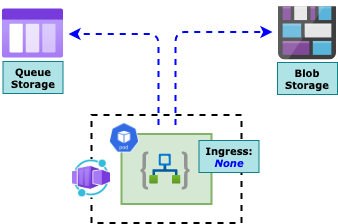
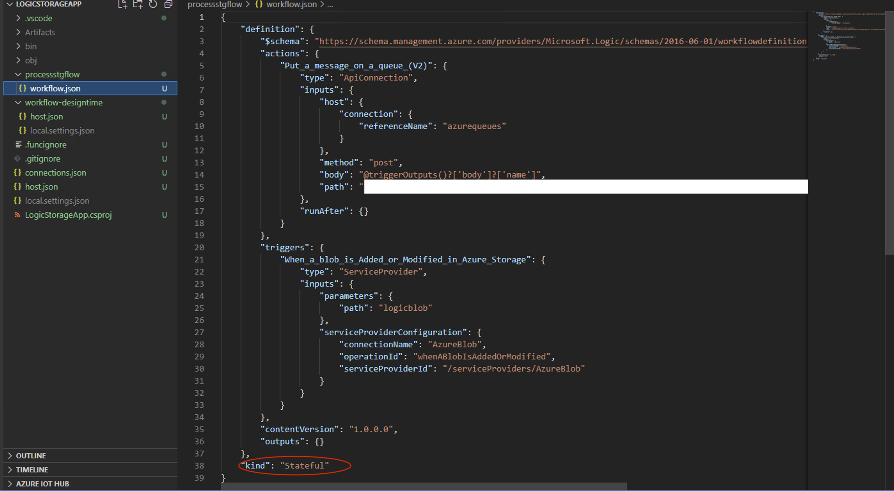
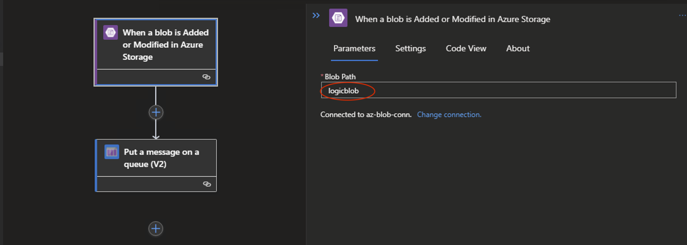
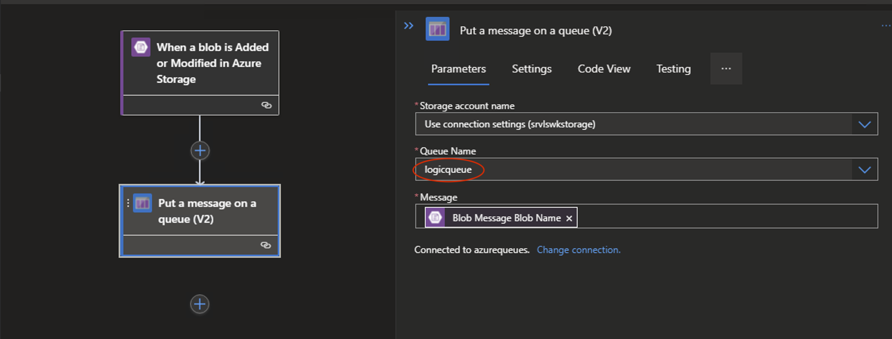
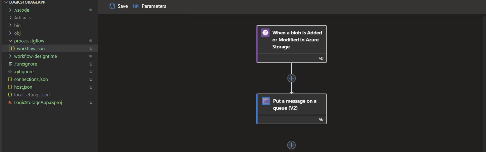
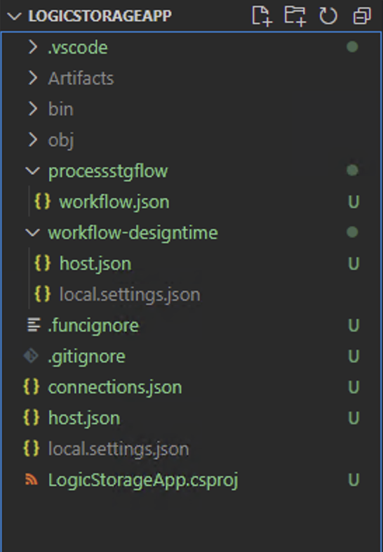
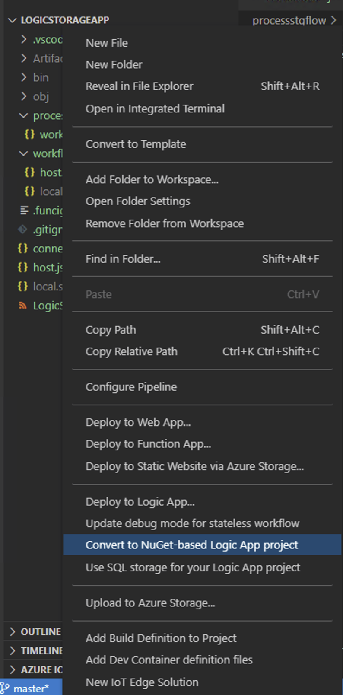
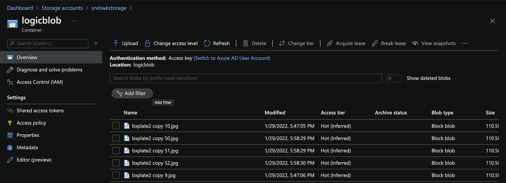
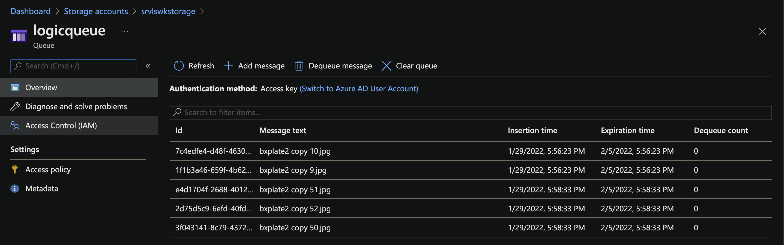

# Run Logic App Anywhere

Logic App *Standard* tier or [Single Tenant Logic App](https://docs.microsoft.com/en-us/azure/logic-apps/single-tenant-overview-compare) has now provided the opportunity to build and containerize logic app and thus allowing it to run anywhere - *any Cloud, On-Prem or any Infrastructure*. This is hosted as an extension on the Azure Functions runtime and like Azure Function, needs a Storage account to store its state.

This also means that this containerized version of Logic App can now be hosted on managed K8s services like [AKS](https://docs.microsoft.com/en-us/azure/aks/) as well as Serverless Container offerings like [Azure Container Apps](https://docs.microsoft.com/en-us/azure/container-apps/) or on-Prem Bare metal. This implies that developers can now design, develop, build and run Logic App end-to-end locally; finally when everuthing is running fine and then deploy anywhere as they want!

The Only thing that should be considered here is the state of the Logic App which needs to be a Storage account on Azure - apart from this everything else is completely agnostic of the hosting environment! 


## Plan



- **Create** a *Container App* hosted in a [Secured Environment](https://docs.microsoft.com/en-us/azure/container-apps/environment)

- **Build** a *Logic App* with *Standard* tier Locally using VS Code

- **Containerise** the *Logic App* and **Push** the image to an private Container Registry 

- **Deploy** the *Logic App* Container on *Azure Container App* (*for simplicity*)

- **Test** the entire flow end-to-end

- [Source Code -  *Logic Storage App*](https://github.com/monojit18/ContainerApps/tree/master/Microservices/LogicStorageApp) - Used in this article

- [Source Code - *Logic Container Ap*p](https://github.com/monojit18/ContainerApps/tree/master/Microservices/LogicContainerApp) - for reference 

  

## How to Setup

#### Set CLI Varibales

```bash
tenantId="<tenantId>"
subscriptionId="<subscriptionId>"
resourceGroup="<resourceGroup>"
monitoringResourceGroup="<monitoringResourceGroup>?"
location="<location>"
logWorkspace="<logWorkspace>"
basicEnvironment="basic-env"
securedEnvironment="secure-env"
acrName="<acrName>"
registryServer="<container_registry_server>"
registryUserName="<container_registry_username>"
registryPassword="<container_registry_password>"

# Optional - NOT a requirement for Contyainer Apps but mostly for microservice applications
storageName="<storage_account_name>"

# Optional - Primary for Securing Container Apps
containerAppVnetName="containerapp-workshop-vnet"
containerAppVnetId=

# Optional - Subnet for Control plane of the Container Apps Infrastructure
controlPlaneSubnetName="containerapp-cp-subnet"
controlPlaneSubnetId=

# Optional - Subnet for hosting Container Apps
appsSubnetName="containerapp-app-subnet"
appsSubnetId=

# Both Control plane Subnet and Application Services Subnet should be in same VNET viz. $containerAppVnetName
```

#### Configure Azure CLI

```bash
# Add CLI extension for Container Apps
az extension add \
  --source https://workerappscliextension.blob.core.windows.net/azure-cli-extension/containerapp-0.2.0-py2.py3-none-any.whl
  
# Register the Microsoft.Web namespace
az provider register --namespace Microsoft.Web
az provider show --namespace Microsoft.Web
```

#### Create Resourcer Groups

```bash
# Hosting Container Apps
az group create --name $resourceGroup --location $location

# Hosting Log Analytics Workspace for Container Apps
az group create --name $monitoringResourceGroup --location $location
```

#### Create Log Analytics Workspace

```bash
az monitor log-analytics workspace create --resource-group $monitoringResourceGroup --workspace-name $logWorkspace

# Retrieve Log Analytics ResourceId
logWorkspaceId=$(az monitor log-analytics workspace show --query customerId -g $monitoringResourceGroup -n $logWorkspace -o tsv)

# Retrieve Log Analytics Secrets
logWorkspaceSecret=$(az monitor log-analytics workspace get-shared-keys --query primarySharedKey -g $monitoringResourceGroup -n $logWorkspace -o tsv)
```

#### Create Container App Environment

```bash
# Simple environment with no additional security for the underlying sInfrastructure
az containerapp env create --name $basicEnvironment --resource-group $resourceGroup \
  --logs-workspace-id $logWorkspaceId --logs-workspace-key $logWorkspaceSecret --location $location
```


## Deploy Azure Logic App as Container App

Build a **Logic App** with basic request/response workflow - viz. **LogicContainerApp**

- **Run** and test this Logic app as docker container locally
- **Deploy** the Logic App container onto Azure as a *Container App*
- **Host** the Logic App inside a Virtual Network (*Secured Environment*)
- **Expose** the container app with ***No Ingress*** - as no inblound access would be needed for this logic app

#### Logic App in a Container

- Let us first Create and Deploy a Logic app as Docker Container

- Logic App runs an Azure Function locally and hence few tools/extensions need to be installed

  

  ##### Pre-Requisites

  - Azure Function Core Tools - [v3.x](https://docs.microsoft.com/en-us/azure/azure-functions/functions-run-local?tabs=v3%2Cwindows%2Ccsharp%2Cportal%2Cbash)
    - The abobve link is for macOS; please install the appropriate links in the same page for other Operating Systems
    - At the time of writing, Core tools 3.x only supports the *Logic App Designer* within Visual Studio Code
    - The current example has been tested with - Function Core Tools version **3.0.3904** on a *Windows box*
  - [Docker Desktop for Windows](https://hub.docker.com/editions/community/docker-ce-desktop-windows)
  - A **Storage Account** on Azure - which is needed by any Azure function App
    - Logic App (*aka Azure Function*) would use this storage to cache its state
  - VS Code Extension for [Standard Logic App](https://marketplace.visualstudio.com/items?itemName=ms-azuretools.vscode-azurelogicapps#:~:text=Azure%20Logic%20Apps%20for%20Visual,Apps%20directly%20from%20VS%20Code.)
  - VS Code Extension for [Azure Function](https://marketplace.visualstudio.com/items?itemName=ms-azuretools.vscode-azurefunctions) 
  - VS Code extension for [Docker](https://marketplace.visualstudio.com/items?itemName=ms-azuretools.vscode-docker)
    - This is Optional but recommended; it makes life easy while dealing with *Dockerfile* and *Docker CLI* commands

- Create a Local folder to host all files related Logic App - viz. *LogicStorageApp*

- Open the folder in VS Code

- Create a *New Logic App Project* in this Folder 

  - Choose *Stateful* workflow in the process and name accordingly - viz. *processstgflow*

  - This generates all necessary files and sub-folders within the current folder

    - A folder named *processstgflow* is also added which contains the **workflow.json** file

    - This describes the Logic App Actions/triggers

    - This example uses one *Blob* trigger and one *Queue* trigger

      


- Right click on the *workflow.json* file and Open the *Logic App Designer* - *this might take few seconds to launch*

- Add **Blob** trigger

  

  

- Add **Queue** trigger

  

  

  

  

- Save the Designer changes

- Right click on the empty area on the workspace folder structure and Open the Context menu

  

  

  

  - Select the menu options that says - *Convert to Nuget-based Logic App project*

  - This would generate .NET specific files - along with a *LogicStorageApp.csproj* file

    

    

    
  
  - Open the **local.settings.json** file
  
    - Replace the value of **AzureWebJobsStorage** variable with the value from *Storage Account Connection string* created earlier
  
  - Add a **Dockerfile** in the workspace
  
    ```bash
    FROM mcr.microsoft.com/azure-functions/node:3.0
    
    ENV AzureWebJobsScriptRoot=/home/site/wwwroot \
         AzureFunctionsJobHost__Logging__Console__IsEnabled=true \
       FUNCTIONS_V2_COMPATIBILITY_MODE=true \     
         AzureWebJobsStorage='' \
       AZURE_FUNCTIONS_ENVIRONMENT=Development \
         WEBSITE_HOSTNAME=localhost \
       WEBSITE_SITE_NAME=logicstorageapp
       
    COPY ./bin/Debug/netcoreapp3.1 /home/site/wwwroot
    
    ```
    
- **WEBSITE_SITE_NAME** - this is the name by which entries are created in Storage Account by the Logic App while caching its state
  
- **Build** docker image
  
  ```
    docker build -t <repo_name>/<image_name>:<tag> .
    ```
  - **Create** and **Run** the Logic App Container
  
    ```bash
  docker run --name logicstorageapp -e AzureWebJobsStorage=$azureWebJobsStorage -d -p 8080:80 <repo_name>/<image_name>:<tag>
    ```


  #### Setup Azure Container App

  - Create *Virtual Network* to inject Container Apps

    ```bash
    containerAppVnetId=$(az network vnet show -n $containerAppVnetName --resource-group $resourceGroup --query="id" -o tsv)
    
    controlPlaneSubnetId=$(az network vnet subnet show -n $controlPlaneSubnetName --vnet-name $containerAppVnetName --resource-group $resourceGroup --query="id" -o tsv)
    
    appsSubnetId=$(az network vnet subnet show -n $appsSubnetName --vnet-name $containerAppVnetName --resource-group $resourceGroup --query="id" -o tsv)
    
    ```

    

  - Create a *Secured Environment* for Azure Container Apps with this *Virtual Network*

    ```bash
    az containerapp env create --name $securedEnvironment --resource-group $resourceGroup \
      --logs-workspace-id $logWorkspaceId --logs-workspace-key $logWorkspaceSecret --location $location \
      --controlplane-subnet-resource-id $controlPlaneSubnetId \
      --app-subnet-resource-id $appsSubnetId
    ```

    

  #### Logic App as Azure Container App

  - Let us now deploy the logic app container onto Azure as Container App

  - Push Logic App container image to *Azure Container Registry*

    ```bash
    # If Container image is already created and tested, use Docker CLI
    docker push <repo_name>/<image_name>:<tag>
      
      OR
      
    # Use Azure CLI command for ACR to build and push
    az acr build -t <repo_name>/<image_name>:<tag> -r $acrName .
    ```

  - Create Azure Container App with this image

    ```bash
    logicappImageName="$registryServer/logicstorageapp:v1.0.0"
    azureWebJobsStorage=""
    blobConnectionString=""
    queueConnectionKey=""
          
    az containerapp create --name logicstorageapp --resource-group $resourceGroup \
      --image $logicappImageName --environment $securedEnvironment \
      --registry-login-server $registryServer --registry-username $registryUserName \
      --registry-password $registryPassword \
      --ingress internal --target-port 80 --transport http \
      --secrets azurewebjobsstorage=$azureWebJobsStorage,bloconnstring=$blobConnectionString,queueconnstring=$queueConnectionKey \
      --environment-variables "AzureWebJobsStorage=secretref:azurewebjobsstorage,AzureBlob_connectionString=secretref:bloconnstring,azurequeues-connectionKey=secretref:queueconnstring"
    ```

## Test End-to-End 

- Let us now **Test** the logic app locally as a Docker container

  - Upload image to the **Blob** container e.g. *logicblob*

    

    

  - Check the image name being added to the **Queue** e.g. *logicqueue*

    

## References

- [Azure Container Apps](https://docs.microsoft.com/en-us/azure/container-apps/overview)					
- [Logic App Standard](https://docs.microsoft.com/en-us/azure/logic-apps/single-tenant-overview-compare)
- Azure APIM [Self-hosted Gateway](https://docs.microsoft.com/en-us/azure/api-management/self-hosted-gateway-overview)
- [Source Repo](https://github.com/monojit18/ContainerApps.git)	

