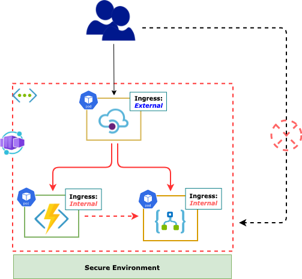
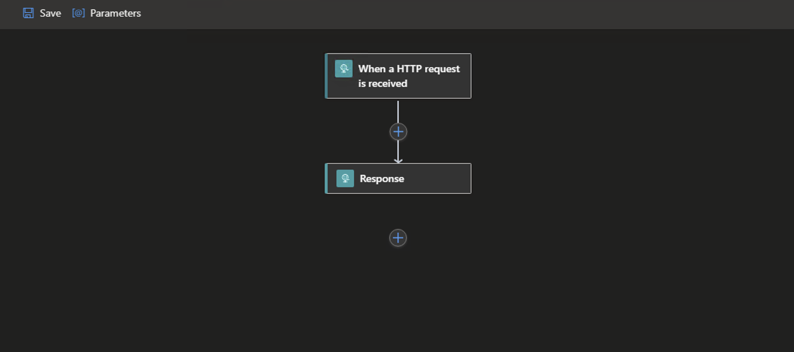

# Connected Microservices with Container Apps

[Azure Container Apps(Preview)](https://docs.microsoft.com/en-us/azure/container-apps/overview) enables users to run containerized applications in a completely Serverless manner providing complete isolation of *Orchestration* and *Infrastructure*. Applications built on Azure Container Apps can dynamically scale based on the various triggers as well as [KEDA-supported scalers](https://keda.sh/docs/scalers/)

Features of Azure Container Apps include:

- Run multiple **Revisions** of containerized applications
- **Autoscale** apps based on any KEDA-supported scale trigger
- Enable HTTPS **Ingress** without having to manage other Azure infrastructure like *L7 Load Balancers* 
- Easily implement **Blue/Green** deployment and perform **A/B Testing** by splitting traffic across multiple versions of an application
- **Azure CLI** extension or **ARM** templates to automate management of containerized applications
- Manage Application **Secrets** securely
- View **Application Logs** using *Azure Log Analytics*
- **Manage** multiple Container Apps using [Self-hosted Gateway](https://docs.microsoft.com/en-us/azure/api-management/self-hosted-gateway-overview) feature of Azure APIM providing rich APIM Policies and Authentication mechainsms to the Container Apps

This article would demonstrate:

- [How to Setup Azure Container Apps using Azure CLI](#How to Setup)
- [How to Deploy a containerized *Logic App* as Azure Container App](#Deploy Azure Logic App as Container App)
- [How to Deploy a containerized *Azure Function* as Azure Container App](#Deploy Azure Function as Container App)
- [Deploy the *Self-hosted Gateway* component of APIM as a Container App](#Deploy Self-hosted Gateway as Container App)
- [Integrate the two Container Apps with *APIM Container App*](#Integrate All using APIM)
- [Test the flow end to end](#Test End-to-End)


## How to Setup

#### Set CLI Varibales

```bash
tenantId="<tenantId>"
subscriptionId="<subscriptionId>"
resourceGroup="<resourceGroup>"
monitoringResourceGroup="<monitoringResourceGroup>?"
location="<location>"
logWorkspace="<logWorkspace>"
basicEnvironment="basic-env"
securedEnvironment="secure-env"
acrName="<acrName>"
registryServer="<container_registry_server>"
registryUserName="<container_registry_username>"
registryPassword="<container_registry_password>"

# Optional - NOT a requirement for Contyainer Apps but mostly for microservice applications
storageName="<storage_account_name>"

# Optional - Primary for Securing Container Apps
containerAppVnetName="containerapp-workshop-vnet"
containerAppVnetId=

# Optional - Subnet for Control plane of the Container Apps Infrastructure
controlPlaneSubnetName="containerapp-cp-subnet"
controlPlaneSubnetId=

# Optional - Subnet for hosting Container Apps
appsSubnetName="containerapp-app-subnet"
appsSubnetId=

# Both Control plane Subnet and Application Services Subnet should be in same VNET viz. $containerAppVnetName
```


#### Configure Azure CLI

```bash
# Add CLI extension for Container Apps
az extension add \
  --source https://workerappscliextension.blob.core.windows.net/azure-cli-extension/containerapp-0.2.0-py2.py3-none-any.whl
  
# Register the Microsoft.Web namespace
az provider register --namespace Microsoft.Web
az provider show --namespace Microsoft.Web
```


#### Create Log Analytics Workspace

```bash
az monitor log-analytics workspace create --resource-group $monitoringResourceGroup --workspace-name $logWorkspace

# Retrieve Log Analytics ResourceId
logWorkspaceId=$(az monitor log-analytics workspace show --query customerId -g $monitoringResourceGroup -n $logWorkspace -o tsv)

# Retrieve Log Analytics Secrets
logWorkspaceSecret=$(az monitor log-analytics workspace get-shared-keys --query primarySharedKey -g $monitoringResourceGroup -n $logWorkspace -o tsv)
```


#### Create Container App Environment

```bash
# Simple environment with no additional security for the underlying sInfrastructure
az containerapp env create --name $basicEnvironment --resource-group $resourceGroup \
  --logs-workspace-id $logWorkspaceId --logs-workspace-key $logWorkspaceSecret --location $location
```


#### Create *Virtual Network* to inject Container Apps

```bash
containerAppVnetId=$(az network vnet show -n $containerAppVnetName --resource-group $resourceGroup --query="id" -o tsv)

controlPlaneSubnetId=$(az network vnet subnet show -n $controlPlaneSubnetName --vnet-name $containerAppVnetName --resource-group $resourceGroup --query="id" -o tsv)

appsSubnetId=$(az network vnet subnet show -n $appsSubnetName --vnet-name $containerAppVnetName --resource-group $resourceGroup --query="id" -o tsv)

```


#### Create a *Secured Environment* for Azure Container Apps

```bash
az containerapp env create --name $securedEnvironment --resource-group $resourceGroup \
  --logs-workspace-id $logWorkspaceId --logs-workspace-key $logWorkspaceSecret --location $location \
  --controlplane-subnet-resource-id $controlPlaneSubnetId \
  --app-subnet-resource-id $appsSubnetId
```


## Connecting the Dots....





### Deploy Azure Logic App as Container App

- Build a **Logic App** with basic request/response workflow - viz. **LogicContainerApp**
- **Run** and test this Logic app as docker container locally
- **Deploy** the Logic App container onto Azure as a *Container App*
- **Host** the Logic App inside a Virtual Network (*Secured Environment*)
- **Expose** the container app with ***Internal Ingress*** - blocking all public access

#### 	Logic App in a Container

- Let us first Create and Deploy a Logic app as Docker Container

- Logic App runs an Azure Function locally and hence few tools/extensions need to be installed

  ##### Pre-Requisites

  - Azure Function Core Tools - [v3.x](https://docs.microsoft.com/en-us/azure/azure-functions/functions-run-local?tabs=v3%2Cwindows%2Ccsharp%2Cportal%2Cbash)
    - The abobve link is for macOS; please install the appropriate links in the same page for other Operating Systems
    - At the time of writing, Core tools 3.x only supports the *Logic App Designer* within Visual Studio Code
    - The current example has been tested with - Function Core Tools version **3.0.3904** on a *Windows box*
  - [Docker Desktop for Windows](https://hub.docker.com/editions/community/docker-ce-desktop-windows)
  - A **Storage Account** on Azure - which is needed by any Azure function App
    - Logic App (*aka Azure Function*) would use this storage to cache its state
  - VS Code Extension for [Standard Logic App](https://marketplace.visualstudio.com/items?itemName=ms-azuretools.vscode-azurelogicapps#:~:text=Azure%20Logic%20Apps%20for%20Visual,Apps%20directly%20from%20VS%20Code.)
  - VS Code Extension for [Azure Function](https://marketplace.visualstudio.com/items?itemName=ms-azuretools.vscode-azurefunctions) 
  - VS Code extension for [Docker](https://marketplace.visualstudio.com/items?itemName=ms-azuretools.vscode-docker)
    - This is Optional but recommended; it makes life easy while dealing with *Dockerfile* and *Docker CLI* commands

- Create a Local folder to host all files related Logic App - viz. *LogicContainerApp*

- Open the folder in VS Code

- Create a *New Logic App Project* in this Folder 

  - Choose *Stateful* workflow in the process and name accordingly - viz. *httperesflow*

  - This generates all necessary files and sub-folders within the current folder

    - A folder named *httpresflow* is also added which contains the workflow.json file

    - This describes the Logic App Actions/triggers

    - This example uses a Http Request/Response type Logic App for simplicity

    - The Logic App would accept a Post body as below and would return back the same as response

      ```json
      {
          "Zip": "testzip-2011.zip"
      }
      ```

      

    

    

    - Right click on the *workflow.json* file and Open the *Logic App Designer* - *this might take few seconds to launch*

    - Add Http Request trigger

      

      

    - Add Http Respoinse Action

      

      

      

    - Save the Designer changes

    - Right click on the empty area on the workspace folder structure and Open the Context menu

      - Select the menu options that says - *Convert to Nuget-based Logic App project*

      - This would generate .NET specific files - along with a *LogicContainerApp.csproj* file

        

        

      - Open the **local.settings.json** file

        - Replace the value of AzureWebJobsStorage variable with the value from *Storage Account Connection string* created earlier

      - Add a **Dockerfile** in the workspace

        ```bash
        FROM mcr.microsoft.com/azure-functions/node:3.0
        
        ENV AzureWebJobsScriptRoot=/home/site/wwwroot \
             AzureFunctionsJobHost__Logging__Console__IsEnabled=true \
             FUNCTIONS_V2_COMPATIBILITY_MODE=true \     
             AzureWebJobsStorage='' \
             AZURE_FUNCTIONS_ENVIRONMENT=Development \
             WEBSITE_HOSTNAME=localhost \
             WEBSITE_SITE_NAME=logiccontainerapp
        
        COPY ./bin/Debug/netcoreapp3.1 /home/site/wwwroot
        ```

        - **WEBSITE_SITE_NAME** - this is the name by which entries are created in Storage Account by the Logic App while caching its state

          

      - **Build** docker image

        ```bash
        docker build -t <repo_name>/<image_name>:<tag> .
        ```

        

      - **Create** the Logic App Container

        ```bash
        docker run --name logiccontainerapp -e AzureWebJobsStorage=$azureWebJobsStorage -d -p 8080:80 <repo_name>/<image_name>:<tag>
        ```

        

      - Let us now **Run** the logic app locally as a Docker container

        - Open the Storage account created earlier

          - Open the *Containers*

          - Open *azure-webjobs-secrets* blob

            

            

            

        

        


          - Get the value of the **master** key in the **host.json** file

            

        

        


        - Open *POSTMAN* or any Rest client of choice like **curl**

          ```bash
          http://localhost:8080/runtime/webhooks/workflow/api/management/workflows/httpresflow/triggers/manual/listCallbackUrl?api-version=2020-05-01-preview&code=<master_key_value_from_storage_account>
          ```

          

          - This would return the Post callback Url for Http triggered Logic App

            ```json
            {
                "value": "https://localhost:443/api/httpresflow/triggers/manual/invoke?api-version=2020-05-01-preview&sp=%2Ftriggers%2Fmanual%2Frun&sv=1.0&sig=<value>",
                "method": "POST",
                "basePath": "https://localhost/api/httpresflow/triggers/manual/invoke",
                "queries": {
                    "api-version": "2020-05-01-preview",
                    "sp": "/triggers/manual/run",
                    "sv": "1.0",
                    "sig": "<value>"
                }
            }
            ```

          - Copy the value of the **value** parameter from the json response

            

        - Make following Http call

          ```bash
          http://localhost:8080/api/httpresflow/triggers/manual/invoke?api-version=2020-05-01-preview&sp=%2Ftriggers%2Fmanual%2Frun&sv=1.0&sig=<value>
          ```

          

        - Post Body

          ```json
          {
              "Zip": "testzip-2011.zip"
          }
          ```

          

        - Check the response coming back from Logic App as below

          ```json
          {
              "Zip": "testzip-2011.zip"
          }
          ```


        #### Setup Azure Container App

        - Create *Virtual Network* to inject Container Apps

          ```bash
          containerAppVnetId=$(az network vnet show -n $containerAppVnetName --resource-group $resourceGroup --query="id" -o tsv)
          
          controlPlaneSubnetId=$(az network vnet subnet show -n $controlPlaneSubnetName --vnet-name $containerAppVnetName --resource-group $resourceGroup --query="id" -o tsv)
          
          appsSubnetId=$(az network vnet subnet show -n $appsSubnetName --vnet-name $containerAppVnetName --resource-group $resourceGroup --query="id" -o tsv)
          
          ```

          

        - Create a *Secured Environment* for Azure Container Apps with this *Virtual Network*

          ```bash
          az containerapp env create --name $securedEnvironment --resource-group $resourceGroup \
            --logs-workspace-id $logWorkspaceId --logs-workspace-key $logWorkspaceSecret --location $location \
            --controlplane-subnet-resource-id $controlPlaneSubnetId \
            --app-subnet-resource-id $appsSubnetId
          ```

          

        #### Logic App as Azure Container App

        - Let us now deploy the logic app container onto Azure as Container App

        - Push Logic App container image to *Azure Container Registry*

          ```bash
          # If Container image is already created and tested, use Docker CLI
          docker push <repo_name>/<image_name>:<tag>
            
            OR
            
          # Use Azure CLI command for ACR to build and push
          az acr build -t <repo_name>/<image_name>:<tag> -r $acrName .
          ```

        - Create Azure Container App with this image

          ```bash
          logicappImageName="$registryServer/logiccontainerapp:v1.0.0"
                azureWebJobsStorage="<storage_account_connection_string"
                
          az containerapp create --name logicontainerapp --resource-group $resourceGroup \
              --image $logicappImageName --environment $securedEnvironment \
              --registry-login-server $registryServer --registry-username $registryUserName \
              --registry-password $registryPassword \
              --ingress external --target-port 80 --transport http \
              --secrets azurewebjobsstorage=$azureWebJobsStorage \
              --environment-variables "AzureWebJobsStorage=secretref:azurewebjobsstorage"
          ```

        - Note down the Logic App ingress url

          

          

          

          

          

            

### Deploy Azure Function as Container App

This function will be triggerred by a http Post call

- This is going to invoke Logic App internally

- Return the response back to the caller

- Before we Deploy the function app, let us look at its code 

```c#
using System;
using System.IO;
using System.Net.Http;
using System.Threading.Tasks;
using Microsoft.AspNetCore.Mvc;
using Microsoft.Azure.WebJobs;
using Microsoft.Azure.WebJobs.Extensions.Http;
using Microsoft.AspNetCore.Http;
using Microsoft.Extensions.Logging;
using Newtonsoft.Json;
namespace HttpContainerApps
  {
      public static class HttpContainerApps
      {
          [FunctionName("container")]
          public static async Task<IActionResult> Run(
              [HttpTrigger(AuthorizationLevel.Anonymous, "get", Route = null)] HttpRequest req,
              ILogger log)
          {
              log.LogInformation("C# HTTP trigger function processed a request.");
  
              var name = req.Query["name"];
              var cl = new HttpClient();
  
              var uri = $"http://httpcontainerapp-secured.internal.greensea-4ecd9ebc.eastus.azurecontainerapps.io/api/container?name={name}";
              var res = await cl.GetAsync(uri);
              var response = await res.Content.ReadAsStringAsync();
              log.LogInformation($"Status:{res.StatusCode}");
              log.LogInformation($"Response:{response}-v1.0.4");
              response = $"Hello, {response}-v1.0.4";
              // var response = $"Secured, {name}-v1.0.3";
              return new OkObjectResult(response);
          }
      }
  }      
```

Deploy Azure Function app as Container App

```bash
 
httpImageName="$registryServer/httplogiccontainerapp:v1.0.5" logicAppCallbackUrl="https://<logicontainerapp_internal_ingress_url>/runtime/webhooks/workflow/api/management/workflows/httpresflow/triggers/manual/listCallbackUrl?api-version=2020-05-01-preview&code=<master_key_value_from_storage_account>"
  
  logicAppPostUrl="https://<logicontainerapp_internal_ingress_url>/api/httpresflow/triggers/manual/invoke?api-version=2020-05-01-preview&sp=%2Ftriggers%2Fmanual%2Frun&sv=1.0&sig={0}"
  
  az containerapp create --name httplogiccontainerapp --resource-group $resourceGroup \
    --image $httpImageName --environment $securedEnvironment \
    --registry-login-server $registryServer --registry-username $registryUserName \
    --registry-password $registryPassword \
    --ingress internal --target-port 80 --transport http \
    --secrets azurewebjobsstorage=$azureWebJobsStorage,logicappcallbackurl=$logicAppCallbackUrl,logicappposturl=$logicAppPostUrl \
    --environment-variables "AzureWebJobsStorage=secretref:azurewebjobsstorage,LOGICAPP_CALLBACK_URL=secretref:logicappcallbackurl,LOGICAPP_POST_URL=secretref:logicappposturl"
```

This Container App is with Ingress type **Internal** so this would be at exposed publicly  

​    

### Deploy Self-hosted Gateway as Container App

#### Deploy APIM as Container App

Select gateway option in APIM in the Azure Portal


Get the *Endpoint Url* and *Auth Token* from the portal


Define ARM template for APIM Container App

```json
{
          "$schema": "https://schema.management.azure.com/schemas/2019-04-01/deploymentTemplate.json#",
          "contentVersion": "1.0.0.0",
          "parameters": {
              "containerappName": {
                  "defaultValue": "apimcontainerapp",
                  "type": "String"
              },
              "location": {
                  "defaultValue": "eastus",
                  "type": "String"
              },
              "environmentName": {
                  "defaultValue": "secure-env",
                  "type": "String"
              },
              "serviceEndpoint": {
                  "defaultValue": "",
                  "type": "String"
              },
              "serviceAuth": {
                  "defaultValue": "",
                  "type": "String"
              }
          },
          "variables": {},
          "resources": [
              {
                  "apiVersion": "2021-03-01",
                  "type": "Microsoft.Web/containerApps",
                  "name": "[parameters('containerappName')]",
                  "location": "[parameters('location')]",
                  "properties": {
                      "kubeEnvironmentId": "[resourceId('Microsoft.Web/kubeEnvironments', parameters('environmentName'))]",
                      "configuration": {                  
                          "ingress": {
                              "external": true,
                              "targetPort": 8080,
                              "allowInsecure": false,
                              "traffic": [
                                  {
                                      "latestRevision": true,
                                      "weight": 100
                                  }
                              ]
                          }
                      },
                      "template": {
                          // "revisionSuffix": "revapim",
                          "containers": [
                              {
                                  "name": "conainerapp-apim-gateway",
                                  "image": "mcr.microsoft.com/azure-api-management/gateway:latest",                            
                                  "env": [
                                      {
                                          "name": "config.service.endpoint",
                                          "value": "[parameters('serviceEndpoint')]"
                                      },
                                      {
                                          "name": "config.service.auth",
                                          "value": "[parameters('serviceAuth')]"
                                      }
                                  ],
                                  "resources": {
                                      "cpu": 0.5,
                                      "memory": "1Gi"
                                  }
                              }
                          ],
                          "scale": {
                              "minReplicas": 1,
                              "maxReplicas": 3
                          }
                      }
                  }
              }
          ]
      }
```


Deploy APIM as Container App

```bash
apimappImageName="mcr.microsoft.com/azure-api-management/gateway:latest"
serviceEndpoint="<service_Endpoint>"
serviceAuth="<service_Auth>"

az deployment group create -f ./api-deploy.json -g $resourceGroup \
  --parameters serviceEndpoint=$serviceEndpoint serviceAuth=$serviceAuth
```


### Integrate All using APIM

- Add Container Apps as APIM back end

- The Web Service URL would be the *Internal Ingress* url of the *Http Container App*

  

  

  

  

  


### Test End-to-End 

Grab the FQDN of the APIM Container App from the portal


The FQDN can be obtained through Azure CLI as well

```bash
fqdn=$(az containerapp show -g $resourceGroup -n apimcontainerapp --query="configuration.ingress.fqdn")
```

Make a call to the API URL as below and receive the response back

```bash
curl -k -X POST --data '{"zip":"test.zip"}' https://$fqdn/container/api/logicapp/
....

{"zip":"test.zip"}
```


## References

- [Azure Container Apps](https://docs.microsoft.com/en-us/azure/container-apps/overview)					
- [Logic App Standard](https://docs.microsoft.com/en-us/azure/logic-apps/single-tenant-overview-compare)
- Azure APIM [Self-hosted Gateway](https://docs.microsoft.com/en-us/azure/api-management/self-hosted-gateway-overview)
- [Source Repo](https://github.com/monojit18/ContainerApps.git)	

