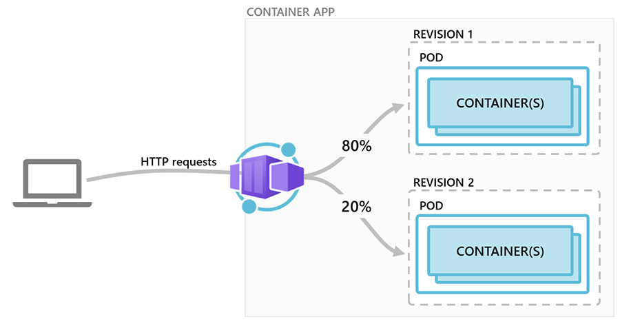

# Get the Best of Containers, Spend No Time on K8s!

## Introduction

Cloud Native application deployment using a K8s based service or tool is now. coomon practice providing -

- Immense Flexibility
- Scalability
- Resiliency
- Reliability

This allows organizations to rollout Stable reelases much faster. But there are downsides of this approach as well:

- Need to have a deep insights into K8s eco-system
- Managing the K8s Cluster - its seceurity, performance, upgrades
- Additional effort needed for ensuring Application Isolation, Security, Multi-tenancy
- Solid implementation of Container Insight solutions for continuous monitoring of Pods, Services and Nodes
- Imperative to have some 3rd party solutions like Service Mesh to have better insights into application flow and integrations for complex systems with large no of granular Microservices 

While managed servies like AKS provides a lot of relief to the Organizations but they want to move towards an even more Managed solution that cxan take away the complexities of K8s eco-system and its sub sequnt management. yet they do not want to compromise on most of the K8s benefits.

[Azure Container Apps](https://docs.microsoft.com/en-us/azure/container-apps/overview) is a service aimed at solving this problem and make Microservices deployment easier and quicker!

### What the Document does

- A deep insights into [Azure Container Apps](https://docs.microsoft.com/en-us/azure/container-apps/overview)
  - Benefits
  - Features
  - How to Setup - *Azure CLI* and *ARM*
  - Connected Examples


### What the Document does NOT

- Deep-dive on [K8s](https://kubernetes.io/docs/home/)

- Deep-dive on [AKS](https://docs.microsoft.com/en-us/azure/aks/intro-kubernetes)

- Programmatic aspects viz. integrationm wioth [Dapr](https://dapr.io/) etc.

  

## Overview


Azure Container Apps enables users to run containerized applications in a completely Serverless manner providing complete isolation of *Orchestration* and *Infrastructure*. Few Common uses of *Azure Container Apps* include:

- Deploying API endpoints
- Hosting background processing applications
- Handling event-driven processing
- Running microservices

Applications built on Azure Container Apps can dynamically scale based on the various triggers as well as [KEDA-supported scaler](https://keda.sh/docs/scalers/)

Features of Azure Container Apps include:

- Run multiple **Revisions** of containerized applications
- **Autoscale** apps based on any KEDA-supported scale trigger
- Enable HTTPS **Ingress** without having to manage other Azure infrastructure like *L7 Load Balancers* 
- Easily implement **Blue/Green** deploymnent and perform **A/B Testing** by splitting traffic across multiple versions of an application
- **Azure CLI** extension or **ARM** templates to automate management of containerized applications
- Manage Application **Secrets** securely
- View **Application Logs** using *Azure Log Analytics*.

## Plan

### How to Setup

#### Set CLI Varibales

```bash
tenantId="<tenantId>"
subscriptionId="<subscriptionId>"
resourceGroup="<resourceGroup>"
monitoringResourceGroup="<monitoringResourceGroup>?"
location="<location>"
logWorkspace="<logWorkspace>"
basicEnvironment="basic-env"
securedEnvironment="secure-env"
acrName="<acrName>"
registryServer="<container_registry_server>"
registryUserName="<container_registry_username>"
registryPassword="<container_registry_password>"

# Optional - NOT a requirement for Contyainer Apps but mostly for microservice applications
storageName="<stoorage_account_name>"

# Optional - Primary for Securing Container Apps
containerAppVnetName="containerapp-workshop-vnet"
containerAppVnetId=

# Optional - Subnet for Control plane of the Container Apps Infrastructure
controlPlaneSubnetName="containerapp-cp-subnet"
controlPlaneSubnetId=

# Optional - Subnet for hosting Container Apps
appsSubnetName="containerapp-app-subnet"
appsSubnetId=

# Both Control plane Subnet and Application Services Subnet should be in same VNET viz. $containerAppVnetName
```

#### Configure Azure CLI

```bash
# Add CLI extension for Container Apps
az extension add \
  --source https://workerappscliextension.blob.core.windows.net/azure-cli-extension/containerapp-0.2.0-py2.py3-none-any.whl
  
# Register the Microsoft.Web namespace
az provider register --namespace Microsoft.Web
az provider show --namespace Microsoft.Web
```

#### Create Resourcer Groups

```bash
# Hosting Container Apps
az group create --name $resourceGroup --location $location

# Hosting Log Analytics Workspace for Container Apps
az group create --name $monitoringResourceGroup --location $location
```

#### Create Log Analytics Workspace

```bash
az monitor log-analytics workspace create --resource-group $monitoringResourceGroup --workspace-name $logWorkspace

# Retrieve Log Analytics ResourceId
logWorkspaceId=$(az monitor log-analytics workspace show --query customerId -g $monitoringResourceGroup -n $logWorkspace -o tsv)

# Retrieve Log Analytics Secrets
logWorkspaceSecret=$(az monitor log-analytics workspace get-shared-keys --query primarySharedKey -g $monitoringResourceGroup -n $logWorkspace -o tsv)
```

#### Create Containr App Environment

```bash
# Simple environment with no additional security for the underlying sInfrastructure
az containerapp env create --name $basicEnvironment --resource-group $resourceGroup \
  --logs-workspace-id $logWorkspaceId --logs-workspace-key $logWorkspaceSecret --location $location
```


### Deploy Apps with Container Apps

#### httpcontainerapp

- A Containerized Application which responds to http Post requests
- The app is built with Azure Function for Http trigger
- Only returns some pre-formatted response message

```bash
httpImageName="$registryServer/httpcontainerapp:v1.0.0"
azureWebJobsStorage="<Storage Connection string as needed by Azure Function>"

# Deploy Container App
az containerapp create --name httpcontainerapp --resource-group $resourceGroup \
--image $httpImageName --environment $basicEnvironment \
--registry-login-server $registryServer --registry-username $registryUserName \
--registry-password $registryPassword \
#External Ingress - generates a Public FQDN
--ingress external --target-port 80 --transport http \
# Min/Max Replicas
--min-replicas 1 --max-replicas 5 \
# CPU/Memory specs; similar to resource quota requests oin K8s Deployment manifest
--cpu 0.25 --memory 0.5Gi \
# Secrets needed by Azure Function App; similar to K8s secrets
--secrets azurewebjobsstorage=$azureWebJobsStorage \
# Environment variables assigned from secrets created; similar to secretRef in K8s Deployment manifest
--environment-variables "AzureWebJobsStorage=secretref:azurewebjobsstorage"
```

- Creates a simple Container App with *External* Ingress

  

  - Generates a *Public FQDN*

    

    - The App can be accessed from anywhere
    - No sepaarte Load Balancer in dded to maintain; Azure does it automatically

  - *--target-port* indicates the Container Port; basically as eposed in Dockerfile and similar to ***containerPort*** in K8s Deployment manifest

  - This Deployment also ensures a *minimum of 1 replica* and *maximum of 5 replicas* for this App

  - Azure Comntainer Registry credentials are passed as CLI arguments

    - *--registry-login-server*
    - *--registry-username*
    - *--registry-password*

  - *CPU* and *Memory* is also specified - similar to resource quota in K8s Deployment manifest

    

  - Secrets are added as part of the Conntainer App Deployment process

    

- Manage Revisions

  - Get a list of Revisions

    ```bash
    az containerapp revision list --name httpcontainerapp --resource-group $resourceGroup --query="[].name"
    ```

  - Deactivate/Activate Revisions

    

    ```bash
    az containerapp revision deactivate --name "<revision_name>" --app httpcontainerapp \
    --resource-group $resourceGroup
    
    az containerapp revision activate --name "<revision_name>" --app httpcontainerapp \
    --resource-group $resourceGroup
    ```

- Split Traffic

  

  - Split Traffic between two revisions by 50%

    ```bash
    az containerapp update --traffic-weight "httpcontainerapp--rv1=50,httpcontainerapp--rv2=50" \
    --name httpcontainerapp --resource-group $resourceGroup
    ```

  - Route all Traffic to latest revision

    ```bash
    # Assuming httpcontainerapp--rv2 as the latest Revision
    az containerapp update --traffic-weight "httpcontainerapp--rv1=0,httpcontainerapp--rv2=100" \
    --name httpcontainerapp --resource-group $resourceGroup
    ```

#### httpcontainerapp-secured

- A Containerized Application which responds to http Post requests

- The app is built with Azure Function for *Http trigger*

- Only returns some pre-formatted response message

- Application runs within a Secured Container App Environment

- Create a **Secured** Environment for the Container App

  ```bash
  az containerapp env create --name $securedEnvironment --resource-group $resourceGroup \
    --logs-workspace-id $logWorkspaceId --logs-workspace-key $logWorkspaceSecret --location $location \
    # Subnet for Control Plane Infrastructure
    --controlplane-subnet-resource-id $controlPlaneSubnetId \
      # Subnet for Container App(s)
    --app-subnet-resource-id $appsSubnetId
    
  # Both Control plane Subnet and Application Services Subnet should be in same VNET viz. $containerAppVnetName
  ```

- Create secured Container app injected into the *Virtual Network*

  ```bash
  az containerapp create --name httpcontainerapp-secured --resource-group $resourceGroup \
  # Secured Environment for the Container App
    --image $httpImageName --environment $securedEnvironment \
    --registry-login-server $registryServer --registry-username $registryUserName \
    --registry-password $registryPassword \
    # Ingress: Internal; generates Private FQDN, no access from outside of the Virtual Network
    --ingress internal --target-port 80 --transport http \
    --min-replicas 1 --max-replicas 5 \
    --cpu 0.25 --memory 0.5Gi \
    --secrets azurewebjobsstorage=$azureWebJobsStorage \
    --environment-variables "AzureWebJobsStorage=secretref:azurewebjobsstorage"
  ```

  - Application would run within a specified Virtual Network
  - Internal/Private FQDN for the form - *<APP_NAME>.internal.<UNIQUE_IDENTIFIER>.<REGION_NAME>.azurecontainerapps.io*
  - All Applicationds within the same *Secured Environment* would share same internal/Private IP address

#### httpcontainerapp-mult

- A Containerized Application which responds to http Post requests

- The app is built with Azure Function for *Http trigger*

- Only returns some pre-formatted response message

- Application running within a *Virtual Network*

- External Ingress to accept calls from Outside of the Virtual Network

- Would call **[httpcontainerapp-secured](#httpcontainerapp-secured)** internally - since both exist within the same *Virtual Network*

  

  ```bash
  az containerapp create --name httpcontainerapp-mult --resource-group $resourceGroup \
    --image $httpImageName --environment $securedEnvironment \
    --registry-login-server $registryServer --registry-username $registryUserName \
    --registry-password $registryPassword \
    --ingress external --target-port 80 --transport http \
    --min-replicas 1 --max-replicas 5 \
    --cpu 0.25 --memory 0.5Gi \
    --secrets azurewebjobsstorage=$azureWebJobsStorage \
    --environment-variables "AzureWebJobsStorage=secretref:azurewebjobsstorage"
  ```

#### blobcontainerapp


- A Containerized [Application](https://raw.githubusercontent.com/monojit18/ContainerApps/master/Microservices/BlobContainerApp/BlobContainerApp/BlobContainerApp.cs?token=GHSAT0AAAAAABM52P35TSLNLMW3NCVOVZXCYPXAB6A) which responds toBlob events

- The app is built with Azure Function for *Blob trigger*

  ```bash
  az containerapp create --name blobcontainerapp --resource-group $resourceGroup \
    --image $blobImageName --environment $basicEnvironment \
    --registry-login-server $registryServer --registry-username $registryUserName \
    --registry-password $registryPassword \
    --min-replicas 1 --max-replicas 10 \
    --secrets azurewebjobsstorage=$azureWebJobsStorage \
    --environment-variables "AzureWebJobsStorage=secretref:azurewebjobsstorage"
  ```

- Unlike previous apps, *NO* **Ingress** is specoified here; since the application is listening to the Blob events which is an *Outbound* call

  

  - No FQDN is generated as Ingress is disabled
  - No *InBound* call is needed (*or possible*)
