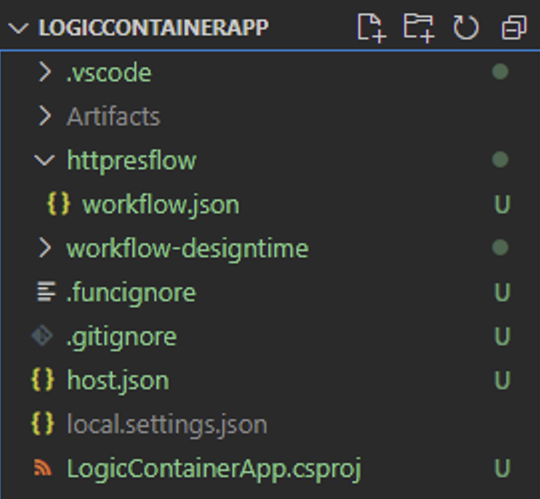
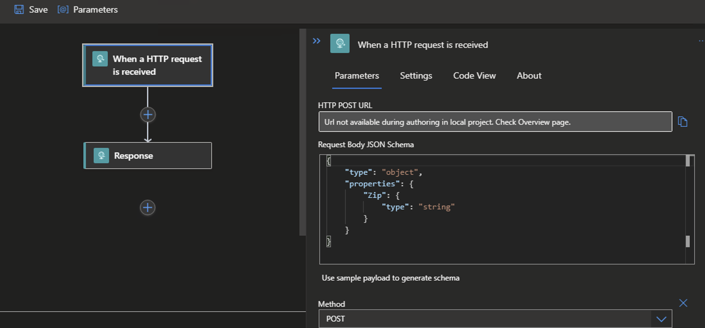
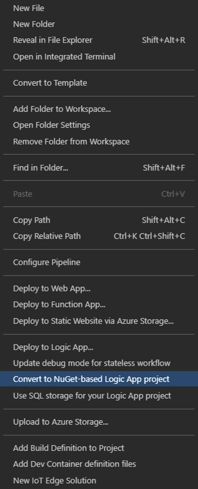

# Get the Best of Containers, Spend No Time on K8s!

## Introduction

Cloud Native application deployment using a K8s based service or tool is now. coomon practice providing -

- Immense Flexibility
- Scalability
- Resiliency
- Reliability

This allows organizations to rollout Stable reelases much faster. But there are downsides of this approach as well:

- Need to have a deep insights into K8s eco-system
- Managing the K8s Cluster - its seceurity, performance, upgrades
- Additional effort needed for ensuring Application Isolation, Security, Multi-tenancy
- Solid implementation of Container Insight solutions for continuous monitoring of Pods, Services and Nodes
- Imperative to have some 3rd party solutions like Service Mesh to have better insights into application flow and integrations for complex systems with large no of granular Microservices 

While managed servies like AKS provides a lot of relief to the Organizations but they want to move towards an even more Managed solution that cxan take away the complexities of K8s eco-system and its sub sequnt management. yet they do not want to compromise on most of the K8s benefits.

[Azure Container Apps](https://docs.microsoft.com/en-us/azure/container-apps/overview) is a service aimed at solving this problem and make Microservices deployment easier and quicker!

### What the Document does

- A deep insights into [Azure Container Apps](https://docs.microsoft.com/en-us/azure/container-apps/overview)
  - Benefits
  - Features
  - How to Setup - *Azure CLI* and *ARM*
  - Connected Examples


### What the Document does NOT

- Deep-dive on [K8s](https://kubernetes.io/docs/home/)

- Deep-dive on [AKS](https://docs.microsoft.com/en-us/azure/aks/intro-kubernetes)

- Programmatic aspects viz. integrationm wioth [Dapr](https://dapr.io/) etc.

  

## Overview


Azure Container Apps enables users to run containerized applications in a completely Serverless manner providing complete isolation of *Orchestration* and *Infrastructure*. Few Common uses of *Azure Container Apps* include:

- Deploying API endpoints
- Hosting background processing applications
- Handling event-driven processing
- Running microservices

Applications built on Azure Container Apps can dynamically scale based on the various triggers as well as [KEDA-supported scaler](https://keda.sh/docs/scalers/)

Features of Azure Container Apps include:

- Run multiple **Revisions** of containerized applications
- **Autoscale** apps based on any KEDA-supported scale trigger
- Enable HTTPS **Ingress** without having to manage other Azure infrastructure like *L7 Load Balancers* 
- Easily implement **Blue/Green** deploymnent and perform **A/B Testing** by splitting traffic across multiple versions of an application
- **Azure CLI** extension or **ARM** templates to automate management of containerized applications
- Manage Application **Secrets** securely
- View **Application Logs** using *Azure Log Analytics*.

## Plan

### How to Setup

#### Set CLI Varibales

```bash
tenantId="<tenantId>"
subscriptionId="<subscriptionId>"
resourceGroup="<resourceGroup>"
monitoringResourceGroup="<monitoringResourceGroup>?"
location="<location>"
logWorkspace="<logWorkspace>"
basicEnvironment="basic-env"
securedEnvironment="secure-env"
acrName="<acrName>"
registryServer="<container_registry_server>"
registryUserName="<container_registry_username>"
registryPassword="<container_registry_password>"

# Optional - NOT a requirement for Contyainer Apps but mostly for microservice applications
storageName="<stoorage_account_name>"

# Optional - Primary for Securing Container Apps
containerAppVnetName="containerapp-workshop-vnet"
containerAppVnetId=

# Optional - Subnet for Control plane of the Container Apps Infrastructure
controlPlaneSubnetName="containerapp-cp-subnet"
controlPlaneSubnetId=

# Optional - Subnet for hosting Container Apps
appsSubnetName="containerapp-app-subnet"
appsSubnetId=

# Both Control plane Subnet and Application Services Subnet should be in same VNET viz. $containerAppVnetName
```

#### Configure Azure CLI

```bash
# Add CLI extension for Container Apps
az extension add \
  --source https://workerappscliextension.blob.core.windows.net/azure-cli-extension/containerapp-0.2.0-py2.py3-none-any.whl
  
# Register the Microsoft.Web namespace
az provider register --namespace Microsoft.Web
az provider show --namespace Microsoft.Web
```

#### Create Resourcer Groups

```bash
# Hosting Container Apps
az group create --name $resourceGroup --location $location

# Hosting Log Analytics Workspace for Container Apps
az group create --name $monitoringResourceGroup --location $location
```

#### Create Log Analytics Workspace

```bash
az monitor log-analytics workspace create --resource-group $monitoringResourceGroup --workspace-name $logWorkspace

# Retrieve Log Analytics ResourceId
logWorkspaceId=$(az monitor log-analytics workspace show --query customerId -g $monitoringResourceGroup -n $logWorkspace -o tsv)

# Retrieve Log Analytics Secrets
logWorkspaceSecret=$(az monitor log-analytics workspace get-shared-keys --query primarySharedKey -g $monitoringResourceGroup -n $logWorkspace -o tsv)
```

#### Create Containr App Environment

```bash
# Simple environment with no additional security for the underlying sInfrastructure
az containerapp env create --name $basicEnvironment --resource-group $resourceGroup \
  --logs-workspace-id $logWorkspaceId --logs-workspace-key $logWorkspaceSecret --location $location
```


### Deploy Apps with Container Apps

#### httpcontainerapp

- A Containerized Application which responds to http Post requests
- The app is built with Azure Function for Http trigger
- Only returns some pre-formatted response message

```bash
httpImageName="$registryServer/httpcontainerapp:v1.0.0"
azureWebJobsStorage="<Storage Connection string as needed by Azure Function>"

# Deploy Container App
az containerapp create --name httpcontainerapp --resource-group $resourceGroup \
--image $httpImageName --environment $basicEnvironment \
--registry-login-server $registryServer --registry-username $registryUserName \
--registry-password $registryPassword \
#External Ingress - generates a Public FQDN
--ingress external --target-port 80 --transport http \
# Min/Max Replicas
--min-replicas 1 --max-replicas 5 \
# CPU/Memory specs; similar to resource quota requests oin K8s Deployment manifest
--cpu 0.25 --memory 0.5Gi \
# Secrets needed by Azure Function App; similar to K8s secrets
--secrets azurewebjobsstorage=$azureWebJobsStorage \
# Environment variables assigned from secrets created; similar to secretRef in K8s Deployment manifest
--environment-variables "AzureWebJobsStorage=secretref:azurewebjobsstorage"
```

- Creates a simple Container App with *External* Ingress

  

  - Generates a *Public FQDN*

    

    - The App can be accessed from anywhere
    - No sepaarte Load Balancer in dded to maintain; Azure does it automatically

  - *--target-port* indicates the Container Port; basically as eposed in Dockerfile and similar to ***containerPort*** in K8s Deployment manifest

  - This Deployment also ensures a *minimum of 1 replica* and *maximum of 5 replicas* for this App

  - Azure Comntainer Registry credentials are passed as CLI arguments

    - *--registry-login-server*
    - *--registry-username*
    - *--registry-password*

  - *CPU* and *Memory* is also specified - similar to resource quota in K8s Deployment manifest

    

  - Secrets are added as part of the Conntainer App Deployment process

    

- Manage Revisions

  - Get a list of Revisions

    ```bash
    az containerapp revision list --name httpcontainerapp --resource-group $resourceGroup --query="[].name"
    ```

  - Deactivate/Activate Revisions

    

    ```bash
    az containerapp revision deactivate --name "<revision_name>" --app httpcontainerapp \
    --resource-group $resourceGroup
    
    az containerapp revision activate --name "<revision_name>" --app httpcontainerapp \
    --resource-group $resourceGroup
    ```

- Split Traffic

  

  - Split Traffic between two revisions by 50%

    ```bash
    az containerapp update --traffic-weight "httpcontainerapp--rv1=50,httpcontainerapp--rv2=50" \
    --name httpcontainerapp --resource-group $resourceGroup
    ```

  - Route all Traffic to latest revision

    ```bash
    # Assuming httpcontainerapp--rv2 as the latest Revision
    az containerapp update --traffic-weight "httpcontainerapp--rv1=0,httpcontainerapp--rv2=100" \
    --name httpcontainerapp --resource-group $resourceGroup
    ```

#### httpcontainerapp-secured

- A Containerized Application which responds to http Post requests

- The app is built with Azure Function for *Http trigger*

- Only returns some pre-formatted response message

- Application runs within a Secured Container App Environment

- Create a **Secured** Environment for the Container App

  ```bash
  az containerapp env create --name $securedEnvironment --resource-group $resourceGroup \
    --logs-workspace-id $logWorkspaceId --logs-workspace-key $logWorkspaceSecret --location $location \
    # Subnet for Control Plane Infrastructure
    --controlplane-subnet-resource-id $controlPlaneSubnetId \
      # Subnet for Container App(s)
    --app-subnet-resource-id $appsSubnetId
    
  # Both Control plane Subnet and Application Services Subnet should be in same VNET viz. $containerAppVnetName
  ```

- Create secured Container app injected into the *Virtual Network*

  ```bash
  az containerapp create --name httpcontainerapp-secured --resource-group $resourceGroup \
  # Secured Environment for the Container App
    --image $httpImageName --environment $securedEnvironment \
    --registry-login-server $registryServer --registry-username $registryUserName \
    --registry-password $registryPassword \
    # Ingress: Internal; generates Private FQDN, no access from outside of the Virtual Network
    --ingress internal --target-port 80 --transport http \
    --min-replicas 1 --max-replicas 5 \
    --cpu 0.25 --memory 0.5Gi \
    --secrets azurewebjobsstorage=$azureWebJobsStorage \
    --environment-variables "AzureWebJobsStorage=secretref:azurewebjobsstorage"
  ```

  - Application would run within a specified Virtual Network
  - Internal/Private FQDN for the form - *<APP_NAME>.internal.<UNIQUE_IDENTIFIER>.<REGION_NAME>.azurecontainerapps.io*
  - All Applicationds within the same *Secured Environment* would share same internal/Private IP address

#### httpcontainerapp-mult

- A Containerized Application which responds to http Post requests

- The app is built with Azure Function for *Http trigger*

- Only returns some pre-formatted response message

- Application running within a *Virtual Network*

- External Ingress to accept calls from Outside of the Virtual Network

- Would call **[httpcontainerapp-secured](#httpcontainerapp-secured)** internally - since both exist within the same *Virtual Network*

  

  ```bash
  az containerapp create --name httpcontainerapp-mult --resource-group $resourceGroup \
    --image $httpImageName --environment $securedEnvironment \
    --registry-login-server $registryServer --registry-username $registryUserName \
    --registry-password $registryPassword \
    --ingress external --target-port 80 --transport http \
    --min-replicas 1 --max-replicas 5 \
    --cpu 0.25 --memory 0.5Gi \
    --secrets azurewebjobsstorage=$azureWebJobsStorage \
    --environment-variables "AzureWebJobsStorage=secretref:azurewebjobsstorage"
  ```

#### blobcontainerapp


- A Containerized [Application](https://raw.githubusercontent.com/monojit18/ContainerApps/master/Microservices/BlobContainerApp/BlobContainerApp/BlobContainerApp.cs?token=GHSAT0AAAAAABM52P35TSLNLMW3NCVOVZXCYPXAB6A) which responds toBlob events

- The app is built with Azure Function for *Blob trigger*

  ```bash
  az containerapp create --name blobcontainerapp --resource-group $resourceGroup \
    --image $blobImageName --environment $basicEnvironment \
    --registry-login-server $registryServer --registry-username $registryUserName \
    --registry-password $registryPassword \
    --min-replicas 1 --max-replicas 10 \
    --secrets azurewebjobsstorage=$azureWebJobsStorage \
    --environment-variables "AzureWebJobsStorage=secretref:azurewebjobsstorage"
  ```

- Unlike previous apps, *NO* **Ingress** is specoified here; since the application is listening to the Blob events which is an *Outbound* call

  

  - No FQDN is generated as Ingress is disabled
  - No *InBound* call is needed (*or possible*)
  - Application responds to the Blob storage events Only


### Deploy with ARM templates

- Deploy **[blobcontainerapp](#blobcontainerapp)** using ARM

  ```json
  {
      "$schema": "https://schema.management.azure.com/schemas/2019-04-01/deploymentTemplate.json#",
      "contentVersion": "1.0.0.0",
      "parameters": {
          "containerappName": {
              "defaultValue": "blobcontainerapp",
              "type": "String"
          },
          "location": {
              "defaultValue": "eastus",
              "type": "String"
          },
          "environmentName": {
              "defaultValue": "basic-env",
              "type": "String"
          },
          "imageName": {
              "defaultValue": "",
              "type": "String"
          },
          "acrServer": {
              "defaultValue": "",
              "type": "String"
          },
          "acrUsername": {
              "defaultValue": "",
              "type": "String"
          },
          "acrPassword": {
              "defaultValue": "",
              "type": "String"
          },
          "azureWebjobsStorage": {
              "defaultValue": "",
              "type": "String"
          }
      },
      "variables": {
  
          "passwordSecretName": "passwordsecret",
          "storageSecretName": "azurewebjobsstorage"
  
      },
      "resources": [
          {
              "apiVersion": "2021-03-01",
              "type": "Microsoft.Web/containerApps",
              "name": "[parameters('containerappName')]",
              "location": "[parameters('location')]",
              "properties": {
                  "kubeEnvironmentId": "[resourceId('Microsoft.Web/kubeEnvironments', parameters('environmentName'))]",
                  "configuration": {   
                      "secrets": [{
                          "name": "azurewebjobsstorage",
                          "value": "[parameters('azureWebjobsStorage')]"
                      },
                      {
                          "name": "passwordsecret",
                          "value": "[parameters('acrPassword')]"
  
                      }],
                      "registries": [{
                          "server": "[parameters('acrServer')]",
                          "username": "[parameters('acrUsername')]",
                          "passwordSecretRef": "[variables('passwordSecretName')]"
                      }]
                  },
                  "template": {                    
                      "containers": [
                          {
                              "name": "blob-container",
                              "image": "[parameters('imageName')]",                            
                              "env": [
                                  {
                                      "name": "AzureWebJobsStorage",
                                      "secretRef": "[variables('storageSecretName')]"
                                  }                                
                              ],
                              "resources": {
                                  "cpu": 0.5,
                                  "memory": "1Gi"
                              }
                          }
                      ],                    
                      "scale": {
                          "minReplicas": 1,
                          "maxReplicas": 10,
                          "rules": [
                          {
                              "name": "blob-scaling",
                              "custom": {
                                  "type": "azure-blob",
                                  "metadata": {
                                      "blobContainerName": "blobcontainerapp",
                                      "blobCount": "3"
                                  },
                                  "auth": [{
                                      "secretRef": "azurewebjobsstorage",
                                      "triggerParameter": "connection"
                                  }]
                              }
                          }]
                      }
                  }
              }
          }
      ]
  }
  ```

  ```bash
  blobImageName="$registryServer/blobcontainerapp:v1.0.0"
  azureWebJobsStorage="<Storage connection string as neded by Azure Function>"
  
  az deployment group create -f ./blob-deploy.json -g $resourceGroup \
  --parameters imageName=$blobImageName acrServer=$registryServer \
  acrUsername=$registryUserName acrPassword=$registryPassword azureWebjobsStorage=$azureWebJobsStorage
  ```

  - Secret values are passed to the Container Apps through *secrets* section in the template

    ```json
    "secrets": [{
                  "name": "azurewebjobsstorage",
                  "value": "[parameters('azureWebjobsStorage')]"
                },
                {
                  "name": "passwordsecret",
                  "value": "[parameters('acrPassword')]"
    
                }]
    ```

  - Scaling configuration is provided by the *scale* section of the template

    - Refer [Scale Triggers](https://docs.microsoft.com/en-us/azure/container-apps/scale-app) as supported by Container Apps
    - Scale *type* and *metadata* are similar to what [KEDA Scalers](https://keda.sh/docs/2.5/scalers/) provie us with

    ```json
    "scale": {
        "minReplicas": 1,
        "maxReplicas": 10,
        "rules": [
        {
            "name": "blob-scaling",
            "custom": {
            "type": "azure-blob",
            "metadata": {
            "blobContainerName": "blobcontainerapp",
            "blobCount": "3"
            },
            "auth": [{
            "secretRef": "azurewebjobsstorage",
            "triggerParameter": "connection"
            }]
        	}
        }]
    }
    ```

    

- Deploy **[httpcontainerapp](#httpcontainerapp)** using ARM

  ```json
  {
      "$schema": "https://schema.management.azure.com/schemas/2019-04-01/deploymentTemplate.json#",
      "contentVersion": "1.0.0.0",
      "parameters": {
          "containerappName": {
              "defaultValue": "httpcontainerapp",
              "type": "String"
          },
          "location": {
              "defaultValue": "eastus",
              "type": "String"
          },
          "environmentName": {
              "defaultValue": "basic-env",
              "type": "String"
          },
          "imageName": {
              "defaultValue": "",
              "type": "String"
          },
          "acrServer": {
              "defaultValue": "",
              "type": "String"
          },
          "acrUsername": {
              "defaultValue": "",
              "type": "String"
          },
          "acrPassword": {
              "defaultValue": "",
              "type": "String"
          },
          "azureWebjobsStorage": {
              "defaultValue": "",
              "type": "String"
          },
          "revisionSuffix": {
              "defaultValue": "",
              "type": "String"
          }
      },
       "variables": {
  
          "passwordSecretName": "passwordsecret",
          "storageSecretName": "azurewebjobsstorage"
  
      },
      "resources": [
          {
              "apiVersion": "2021-03-01",
              "type": "Microsoft.Web/containerApps",
              "name": "[parameters('containerappName')]",
              "location": "[parameters('location')]",
              "properties": {
                  "kubeEnvironmentId": "[resourceId('Microsoft.Web/kubeEnvironments', parameters('environmentName'))]",
                  "configuration": {   
                      "secrets": [{
                          "name": "azurewebjobsstorage",
                          "value": "[parameters('azureWebjobsStorage')]"
                      },
                      {
                          "name": "passwordsecret",
                          "value": "[parameters('acrPassword')]"
  
                      }],
                      "registries": [{
                          "server": "[parameters('acrServer')]",
                          "username": "[parameters('acrUsername')]",
                          "passwordSecretRef": "[variables('passwordSecretName')]"
                      }],
                      "ingress": {
                          "external": true,
                          "targetPort": 80,
                          "allowInsecure": false,
                          "traffic": [
                              {
                                  "latestRevision": true,
                                  "weight": 100
                              }
                              // {
                              //     "revisionName": "httpcontainerapp--rv1",
                              //     "weight": 90
                              // },
                              // {
                              //     "revisionName": "httpcontainerapp--rv2",
                              //     "weight": 10  
                              // }                            
                          ]
                      }
                  },
                  "template": {
                      "revisionSuffix": "[parameters('revisionSuffix')]",
                      "containers": [
                          {
                              "name": "blob-container",
                              "image": "[parameters('imageName')]",                            
                              "env": [
                                  {
                                      "name": "AzureWebJobsStorage",
                                      "secretRef": "[variables('storageSecretName')]"
                                  }                                
                              ],
                              "resources": {
                                  "cpu": 0.5,
                                  "memory": "1Gi"
                              }
                          }
                      ],                    
                      "scale": {
                          "minReplicas": 1,
                          "maxReplicas": 10,
                          "rules": [
                          {
                              "name": "http-scaling",
                              "http": {
                                  "metadata": {
                                      "concurrentRequests": "100"                                
                                  }
                              }
                          }]
                      }
                  }
              }
          }
      ]
  }
  ```

  - Traffic Splitting is handled by *traffic* section of the template

    ```json
    "traffic": [
          {
            "latestRevision": true,
            "weight": 100
          }
          // {
          //     "revisionName": "httpcontainerapp--rv1",
          //     "weight": 90
          // },
          // {
          //     "revisionName": "httpcontainerapp--rv2",
          //     "weight": 10  
          // }                            
    ]
    ```

  

  ## Connecting the Dots...

  - Build a connected Microservices example with *Azure Function*, *Logic App*
    - Each Application to be deployed as a Container App to provide an end to end Serverless experience
    - Complete abstration of *Infrastructure* and *Orchestration* of the underlying resources
    - Expose these apps with *Internal Ingress* for blocking public access
    - Inject all apps into a Virtual Network (*Secured Environment*) providing complete isolation
  - Integrate with Azure APIM to provide a *Gateway* to service to the backend Containerized APIs
    - Create an APIM instance on Azure with a [Self-hosted Gateway](https://docs.microsoft.com/en-us/azure/api-management/self-hosted-gateway-overview)
    - Deploy APIM as a docker container with *Container App* and in the same *Secured Environment* as above
    - Place all Internal Container Apps (*as deploed above*) as backend for the APIM
    - Expose the APIM Container App with *External Ingress* thus making it the only public facing endpoint for the entire system
      - APIM Container App (*Self-hosted Gateway*) would be able to call the internal Container Apps since being part of the same Secured Environment

  

  

  ### Step-by-Step

  #### Logic App in a Container

  - Let us first Create and Deploy a Logic app as Docker Container

  - Logic App runs an Azure Function locally and hence few tools/extensions need to be installed

    ##### Pre-Requisites

    - Azure Function Core Tools - [v3.x](https://docs.microsoft.com/en-us/azure/azure-functions/functions-run-local?tabs=v3%2Cwindows%2Ccsharp%2Cportal%2Cbash)
      - The abobve link is for macOS; please install the appropriate links in the ssme page for other Operating Systems
      - At the time of writing, Core tools 3.x only supports the *Logic App Designer* within Visual Studio Code
      - The current example has been tested with - Function Core Tools version **3.0.3904** on a *Windows box*
    - [Docker Desktop for Windows](https://hub.docker.com/editions/community/docker-ce-desktop-windows)
    - A **Storage Account** on Azure - which is needed by any Azure function App
      - Logic App (*aka Azure Function*) would use this storage to cache its state
    - VS Code Extension for [Standard Logic App](https://marketplace.visualstudio.com/items?itemName=ms-azuretools.vscode-azurelogicapps#:~:text=Azure%20Logic%20Apps%20for%20Visual,Apps%20directly%20from%20VS%20Code.)
    - VS Code Extension for [Azure Function](https://marketplace.visualstudio.com/items?itemName=ms-azuretools.vscode-azurefunctions) 
    - VS Code extension for [Docker](https://marketplace.visualstudio.com/items?itemName=ms-azuretools.vscode-docker)
      - This is Optional but recommended; it makes life easy while dealing with *Dockerfile* and *Docker CLI* commands

  - Create a Local folder to host all files related Logic App - viz. *LogicContainerApp*

  - Open the folder in VS Code

  - Create a *New Logic App Project* in this Folder 

    - Choose *Stateful* workflow in the process and name accordingly - viz. *httperesflow*

    - This generateds all necessary files and sub-folders within the current folder

      - A folder named *httpresflow* is also added which contains the workflow.json file
      - This describes the Logic App Actions/triggers
      - This example uses a Http Request/Response type Logic App for simplicity 

      

      - Right click on the *workflow.json* file and Open the *Logic App Designer* - *this might take few seconds to launch*

      - Add Http Request trigger

        

      - Add Http Respoinse Action

        

        

      - Save the Designer changes

      - Right click on the empty area on the workspace folder structure and Open the Context menu

        - Select the menu options that says - *Convert to Nuget-based Logic App project*

          

          - This would generate .NET specific files - along with a *LogicContainerApp.csproj* file

        - Open the **local.settings.json** file

          - Replace the value of AzureWebJobsStorage variable with the value from Storage Account string created for 

        - Add Dockerfile in the workspace

          ```bash
          FROM mcr.microsoft.com/azure-functions/node:3.0
          
          ENV AzureWebJobsScriptRoot=/home/site/wwwroot \
               AzureFunctionsJobHost__Logging__Console__IsEnabled=true \
               FUNCTIONS_V2_COMPATIBILITY_MODE=true \     
               AzureWebJobsStorage='' \
               AZURE_FUNCTIONS_ENVIRONMENT=Development \
               WEBSITE_HOSTNAME=localhost \
               WEBSITE_SITE_NAME=logiccontainerapp
          
          COPY ./bin/Debug/netcoreapp3.1 /home/site/wwwroot
          ```

          - WEBSITE_SITE_NAME is imprtant - this si the name byu which 

  ### 
